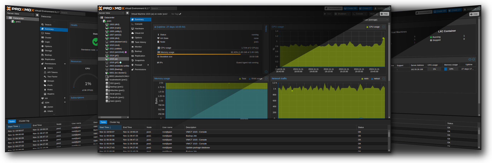
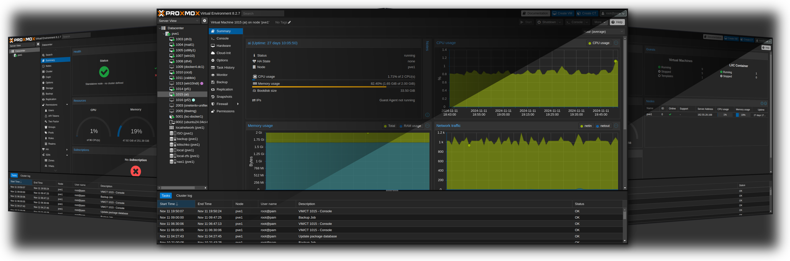
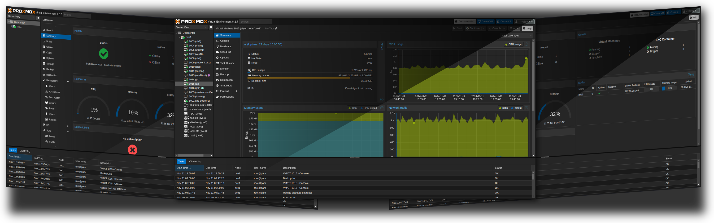
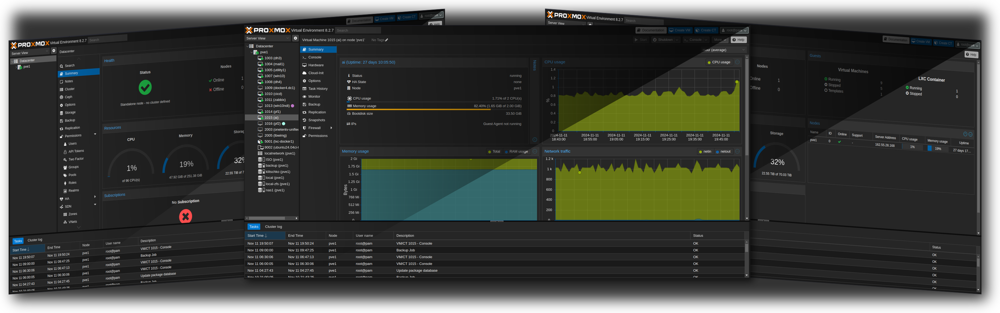
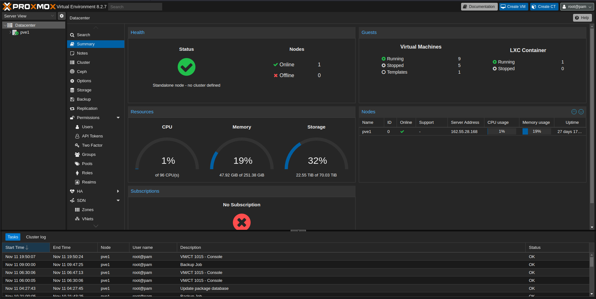
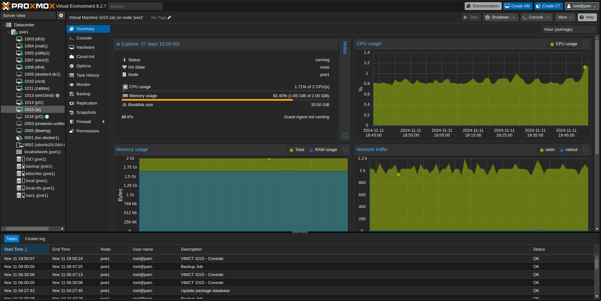

# Magick Tricks

A shell script that takes standard screenshots and morphs them into a professional-looking collage with perspective or mirror tilt effects.



## Features

- Creates professional-looking screenshot collages with perspective or mirror tilt effects
- Automatically generates two variants of each effect (normal and inverted)
- Customizable shadow effects with 3 presets
- Adjustable background colors and opacity
- Supports compact or wide layouts
- Preserves image quality with automatic height normalization

## Prerequisites

- ImageMagick
- Bash shell
- BC (Basic Calculator)

## Installation

1. Clone this repository:
   ```bash
   git clone https://github.com/yourusername/magick-tricks.git
   cd magick-tricks
   ```

2. Make the script executable:
   ```bash
   chmod +x tricks.sh
   ```

## Usage

```bash
./tricks.sh <perspective|mirrortilt> image1 image2 image3 [options]
```

### Subcommands

- `perspective`: Creates a collage with a central vanishing point effect
- `mirrortilt`: Creates a collage with mirrored tilt effects

### Options

- `--compact`: Overlap the background images for a more compact layout
- `--wide`: Add spacing between images (default)
- `--cover-shadow=N`: Use cover shadow preset (1, 2, or 3), defaults to 1
- `--cover-shadow-opacity=N`: Set shadow opacity (0-1 or 0-100%), defaults to 70%
- `--background-color=HEX`: Set background color (defaults to #000000)
- `--background-opacity=N`: Set background opacity (0-1 or 0-100%), defaults to 0
- `--no-cleanup`: Keep temporary files for debugging
- `--output-dir=PATH`: Specify output directory (defaults to current directory)

## Examples

### Perspective Effect

Output with perspective effect:




```bash
./tricks.sh perspective input_1.png input_2.png input_3.png --cover-shadow=1
```

### Mirror Tilt Effect

Output with mirror tilt effect:

 

```bash
./tricks.sh mirrortilt input_1.png input_2.png input_3.png --cover-shadow=2 --compact
```

Input images:

  

## Advanced Examples

### Custom Background

```bash
./tricks.sh perspective input_1.png input_2.png input_3.png \
    --background-color=#2a2a2a \
    --background-opacity=0.8
```

### Compact Layout with Custom Shadow

```bash
./tricks.sh mirrortilt input_1.png input_2.png input_3.png \
    --compact \
    --cover-shadow=3 \
    --cover-shadow-opacity=50%
```


## Tips

1. For best results, use input images with:
   - Similar aspect ratios
   - Minimum width of 1600px
   - Minimum height of 768px

2. The script automatically normalizes image heights to 768px while maintaining aspect ratios.

3. Use the `--no-cleanup` option to inspect intermediate files when troubleshooting.

## Troubleshooting

If you encounter issues:

1. Ensure ImageMagick is properly installed:
   ```bash
   convert --version
   ```

2. Check file permissions:
   ```bash
   chmod +x tricks.sh
   ```

3. Verify input image dimensions:
   ```bash
   identify input_1.png
   ```

## License

This project is licensed under the MIT License - see the LICENSE file for details.

## Contributing

Contributions are welcome! Please feel free to submit a Pull Request.