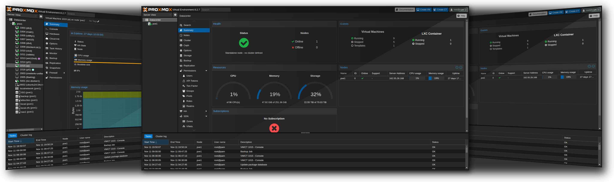

# Magick Tricks

A shell script that takes standard screenshots and morphs them into a professional-looking collage with perspective or mirror tilt effects. Uses ImageMagick with several bundled png filters to add a bit of glamour.



## Features

- Works with three images - centre, left and right.
- Horizontal vanishing point perpsective preset
- Vertical mirror tilt preset
- Generates two variants of each effect (inward and outward facing side images)
- Customizable cover shadow effects with 3 presets (3 looks the slickest)
- Adjustable background colours and opacity
- Compact, standard or wide layout (wide is default as the others don't cut the mustard yet)
- Preserves image quality with automatic height normalization

## To-Do

Lots. Sorting the drop shadows out and adding some input handling for different aspect ratios are probably highest on my list.

## Installation

### Prerequisites

- ImageMagick
- bc

### Clone this repository

```bash
git clone https://github.com/yourusername/magick-tricks.git
cd magick-tricks
```

### Make the script executable

   ```bash
   chmod +x tricks.sh
   ```

## Usage

```bash
./tricks.sh <perspective|mirrortilt> image1 image2 image3 [options]
```

### Subcommands

- `perspective`: Creates a collage with a central vanishing point effect
- `mirrortilt`: Creates a collage with mirrored tilt effects

### Options

- `--compact`: Overlap the background images for a more compact layout
- `--wide`: Add spacing between images (default)
- `--cover-shadow=N`: Use cover shadow preset (1, 2, or 3), defaults to 1
- `--cover-shadow-opacity=N`: Set shadow opacity (0-1 or 0-100%), defaults to 70%
- `--background-color=HEX`: Set background color (defaults to #000000)
- `--background-opacity=N`: Set background opacity (0-1 or 0-100%), defaults to 0
- `--no-cleanup`: Keep temporary files for debugging
- `--output-dir=PATH`: Specify output directory (defaults to current directory)

## Examples

### Perspective Effect

Output with perspective effect:


```bash
./tricks.sh perspective input_1.png input_2.png input_3.png --cover-shadow=1
```

### Mirror Tilt Effect

Output with mirror tilt effect:

 

```bash
./tricks.sh mirrortilt input_1.png input_2.png input_3.png --cover-shadow=2 --compact
```

Input images:

  

## Advanced Examples

### Custom Background

```bash
./tricks.sh perspective input_1.png input_2.png input_3.png \
    --background-color=#2a2a2a \
    --background-opacity=0.8
```

### Compact Layout with Custom Shadow

```bash
./tricks.sh mirrortilt input_1.png input_2.png input_3.png \
    --compact \
    --cover-shadow=3 \
    --cover-shadow-opacity=50%
```

## Tips

1. For best results, use input images with:
   - Similar aspect ratios
   - Minimum width of 1600px
   - Minimum height of 768px

2. The script automatically normalizes image heights to 768px while maintaining aspect ratios.

3. Use the `--no-cleanup` option to inspect intermediate files when troubleshooting OR if you want to use one of the elements as part of the script. It's deliberately broken down into more steps than are necessary for this reason.

## Troubleshooting

Make sure ImageMagick is properly installed:

```bash
magick --version
```

The script was created with ImageMagick 7 and will likely not work with IM6 without some minor modifications due to deprecated handling of alpha channels.

This is a long way from finished and does not have much capacity for normalising images of different sizes or aspect ratios. The examples use 1600x768 images. which is roughly a browser's viewport.

Questions, comments etc. - get in touch!
